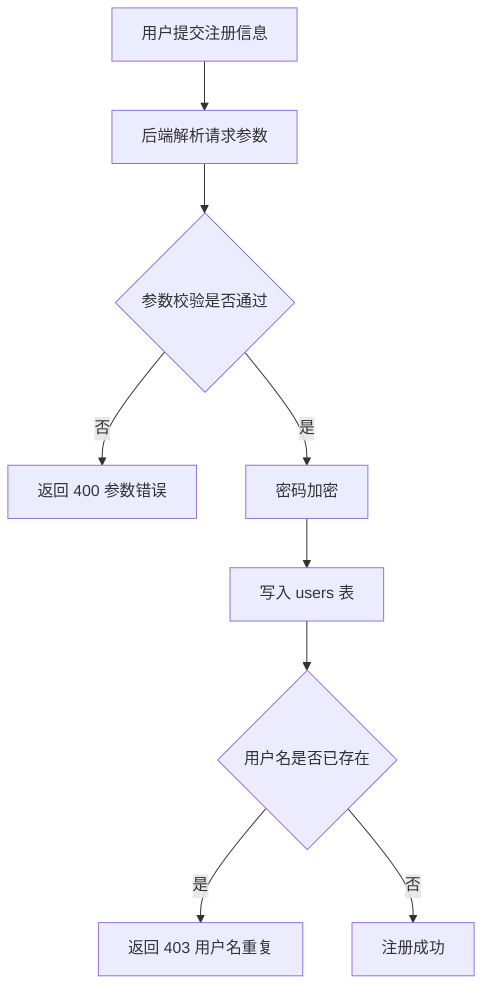
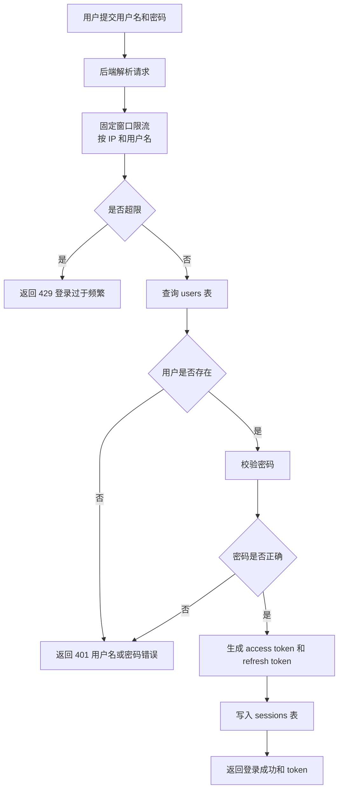
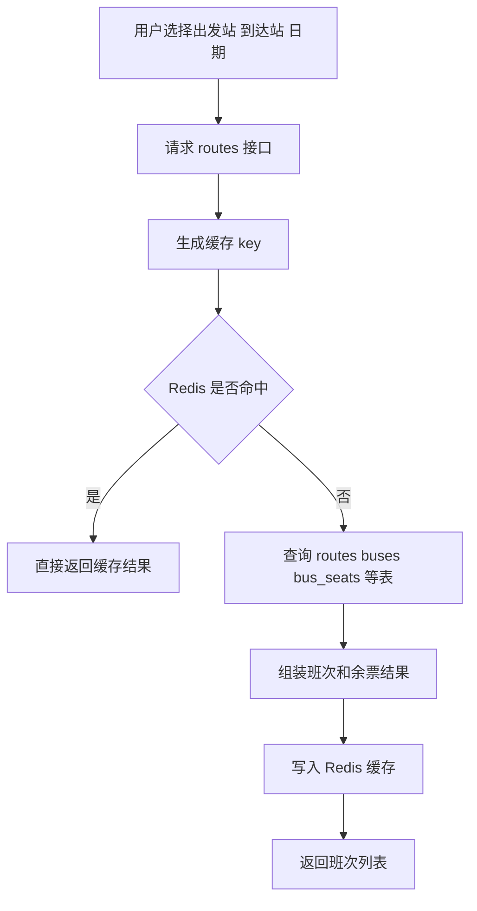
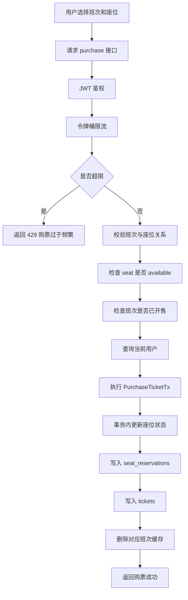
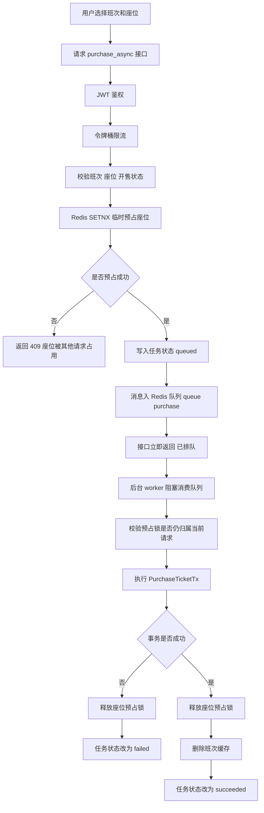
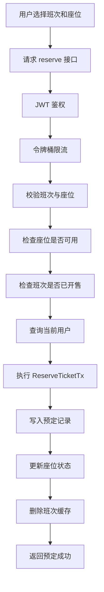
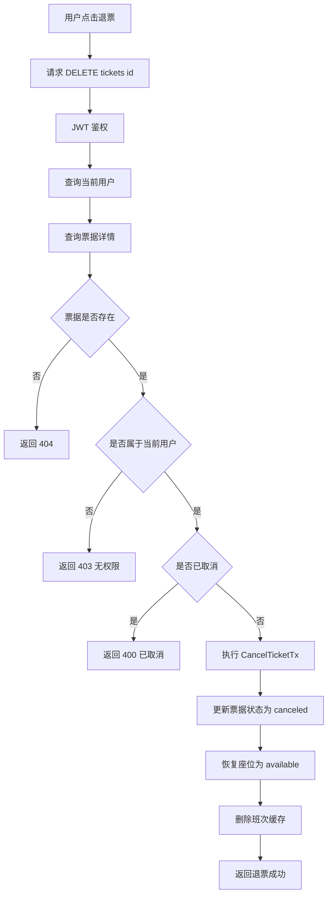
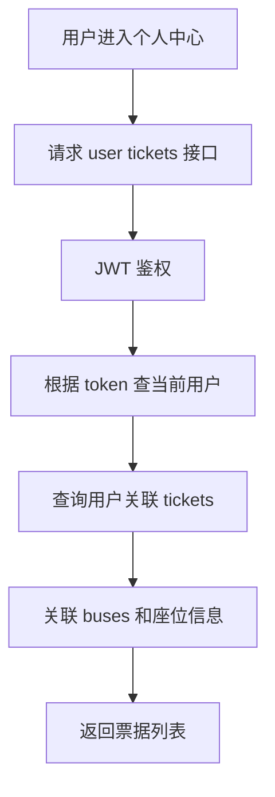
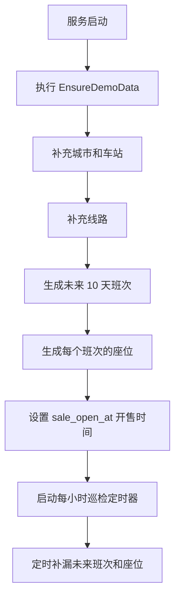
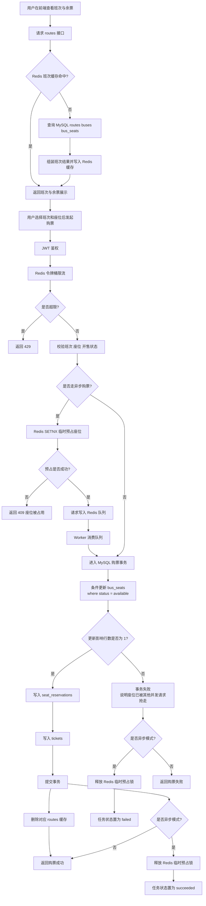

# Ticket Master 业务流程图

下面按核心业务拆分流程图，使用 `Mermaid` 语法表示，适合直接放进 Markdown、Typora、Obsidian、GitHub 或 Mermaid Live Editor。

## 1. 用户注册

## 2. 用户登录

## 3. 线路与班次查询

## 4. 同步购票

## 5. 异步购票削峰

## 6. 座位预定

## 7. 退票

## 8. 个人中心查票据

## 9. 自动补充班次数据

## 10. 购票阶段缓存与数据库协同流程

### 说明

- Redis 缓存只负责加速班次查询和削峰控流，不直接决定最终能否买到票。
- 真正防超卖的关键在 MySQL 事务内的条件更新：只有一个请求能把座位从 `available` 改为 `purchased` 或 `reserved`。
- 购票成功后删除班次缓存，下一次查询会重新从数据库加载最新余票。
