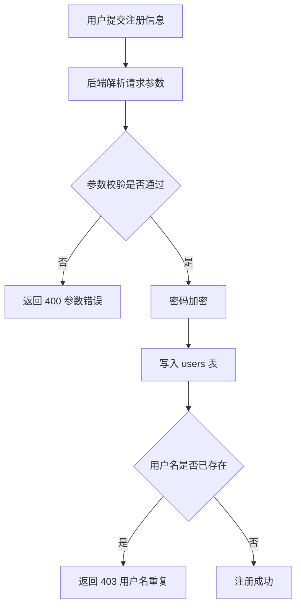
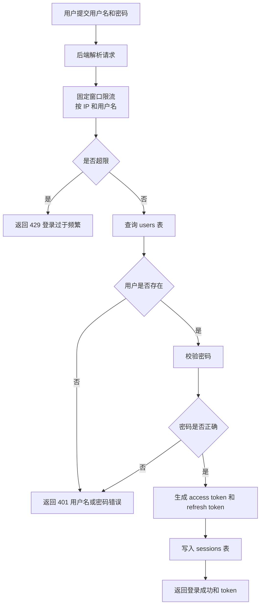
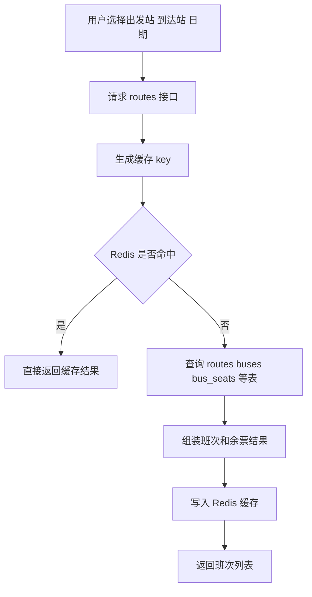
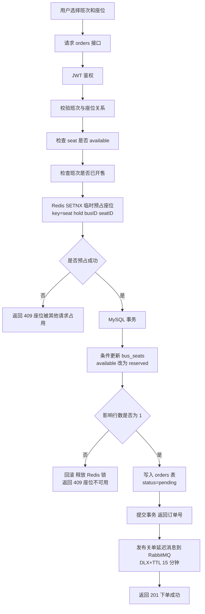
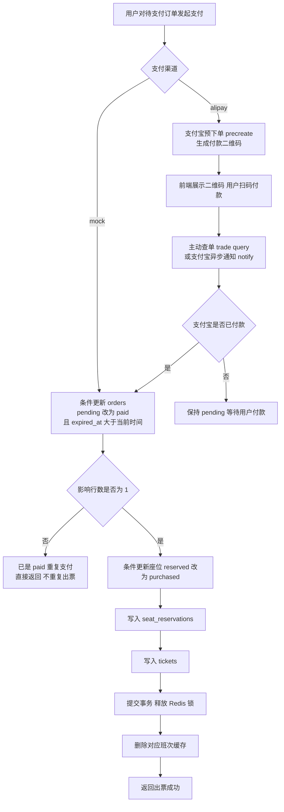
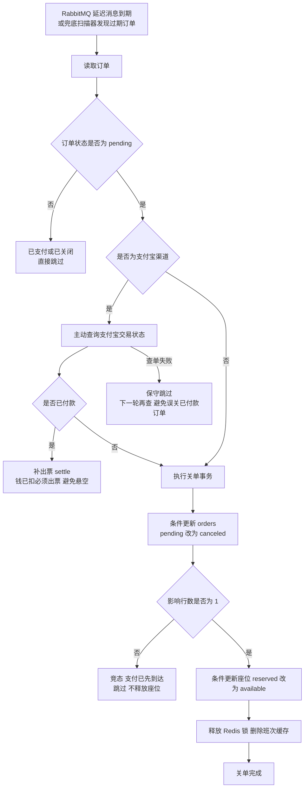
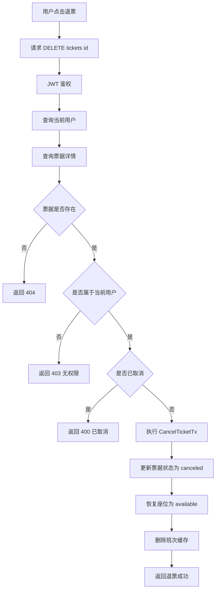
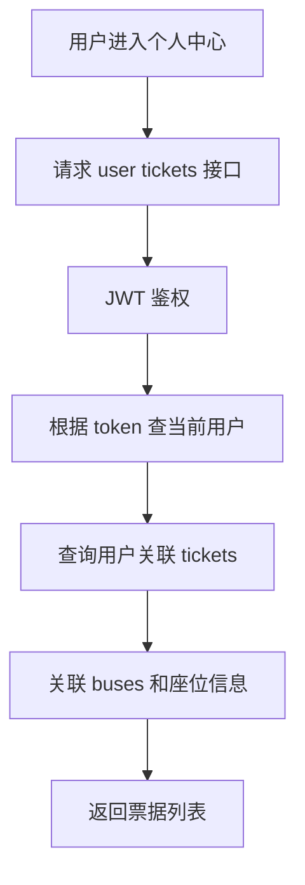
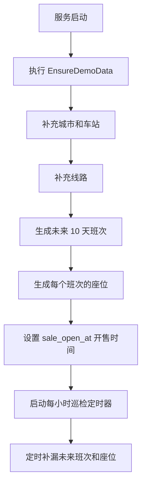
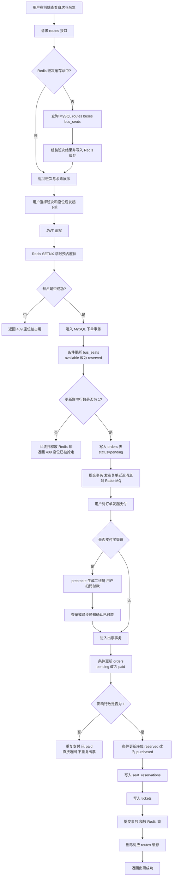

# Tickets 业务流程图

下面按核心业务拆分流程图，使用 `Mermaid` 语法表示，适合直接放进 Markdown、Typora、Obsidian、GitHub 或 Mermaid Live Editor。

## 1. 用户注册

## 2. 用户登录

## 3. 线路与班次查询

## 4. 下单（创建订单）

## 5. 支付与出票

## 6. 订单超时关单

## 7. 退票

## 8. 个人中心查票据

## 9. 自动补充班次数据

## 10. 购票阶段缓存与数据库协同流程

### 说明

- Redis 缓存只负责加速班次查询，不直接决定最终能否买到票；Redis 预占锁只做快速分流，也不承担正确性。
- 真正防超卖的关键在 MySQL 事务内的条件更新：下单时只有一个请求能把座位从 `available` 改为 `reserved`，支付时只有一个请求能把订单从 `pending` 改为 `paid`。
- 订单过期由 RabbitMQ 延迟消息触发关单，兜底扫描器双保险，关单/支付在数据库层通过 `status='pending'` 条件互斥。
- 购票成功后删除班次缓存，下一次查询会重新从数据库加载最新余票。
